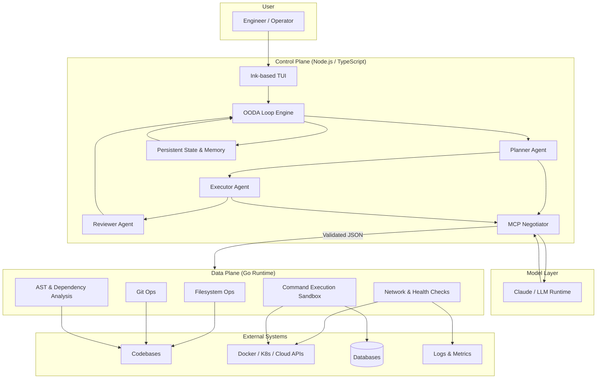
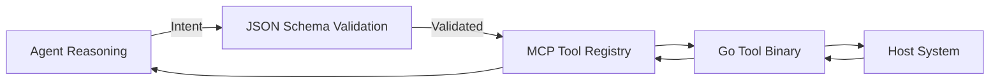
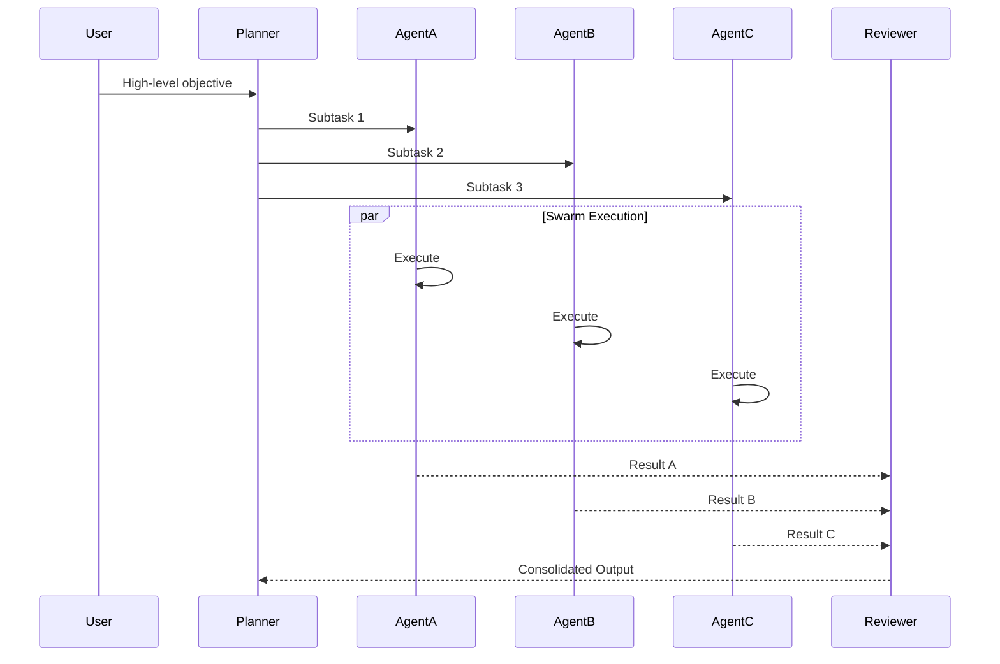

<h1 align="center">sudo-summon-swarm</h1>

  <strong>"Root access for your cognitive workforce."</strong> 
  An agentic control plane that connects LLM reasoning with deterministic system execution.

  
  
  
  

  <strong>The Autonomous Orchestration Plane for Backend Engineering</strong>

---

## Executive Summary

**sudo-summon-swarm** is an experimental autonomous orchestration platform designed to bridge the gap between **large language model (LLM) reasoning** and **real-world backend, infrastructure, and DevOps execution**.

Unlike traditional coding assistants that act as passive text-generation tools, ARCHON functions as an **Agentic Control Plane**. It continuously observes system state, reasons about architecture and operational signals, and executes validated actions using a recursive **OODA Loop (Observe → Orient → Decide → Act)**.

ARCHON is built for **AI-native backend engineering**, not chat-based automation.

---

## Architectural Philosophy

ARCHON follows a **Hybrid Runtime Architecture** that strictly separates high-level cognition from low-level execution.

This design ensures:

- Deterministic and auditable system behavior
- High throughput for IO-heavy workloads
- Strong safety boundaries for destructive operations

### Control Plane vs Data Plane

| Plane | Responsibility | Characteristics |
|------|---------------|----------------|
| **Control Plane** | Reasoning, planning, orchestration | Stateful, adaptive, model-driven |
| **Data Plane** | Execution, IO, system interaction | Deterministic, high-performance |

---

## The Cognitive Core (Control Plane)

**Runtime:** Node.js / TypeScript  
**Framework:** LangGraph.js  

The Cognitive Core is responsible for **thinking**, not **doing**.

### Responsibilities

- Stateful, multi-turn agent reasoning
- Recursive planning and replanning via OODA loops
- Tool discovery and negotiation via **Model Context Protocol (MCP)**
- Enforcing structured outputs and execution constraints

### Interface

sudo-summon-swarm exposes a **reactive Terminal User Interface (TUI)** built using **Ink (React for CLI)**:

- Live agent reasoning and decisions
- Code diffs and execution previews
- Dependency graphs and execution timelines

---

## The Kinetic Layer (Data Plane)

**Runtime:** Go (Golang)

The Kinetic Layer is responsible for **doing**, not **thinking**.

### Responsibilities

- Latency-critical and IO-heavy operations
- Deterministic system execution
- High-concurrency filesystem and network access

### Capabilities

- **AST Parsing** — fast dependency analysis and code graph construction
- **Filesystem Operations** — high-concurrency search, refactors, and bulk edits
- **Git Operations** — diff generation, blame analysis, patch creation
- **Network Probing** — direct socket-based health checks

This layer is intentionally model-agnostic and fully auditable.

---

### MCP Tool Invocation Flow

---

## Core Capabilities

### Autonomous DevOps & SRE

- **Self-Healing Infrastructure**  
  Consume metrics (e.g., Prometheus), detect anomalies such as OOM kills or CPU starvation, and propose corrective actions like autoscaling or resource reallocation.

- **Incident Remediation**  
  Automated log analysis and root-cause triangulation using **RAG (Retrieval Augmented Generation)** against internal runbooks and historical incidents.

---

### Distributed Systems Engineering

- **Legacy Modernization**  
  Swarm-based decomposition of monolithic services into domain-aligned microservices, with autogenerated Go/gRPC interfaces.

- **Architecture Verification**  
  Validates system design against distributed systems best practices:
  - Idempotent event handlers
  - Safe retry semantics
  - Correct transactional boundaries

---

### Agent Execution Modes (Swarm / Pipeline)

---

### Safety & Governance

- **Human-in-the-Loop Execution**  
  All destructive actions (database migrations, Terraform applies, production deploys) require explicit human approval.

- **Deterministic Outputs**  
  All agent-to-system calls enforce strict JSON schemas (via Zod), eliminating hallucinated commands.

- **Sandboxed Runtime**  
  Execution occurs within constrained environments with explicit capability boundaries.

---

## Technical Stack

| Component | Technology | Rationale |
|---------|-----------|-----------|
| Orchestration | LangGraph.js | Stateful, cyclic agent graphs |
| UI | Ink (React) | Rich, reactive CLI interface |
| Execution Engine | Go | High-performance concurrency |
| Model Layer | Claude 3.5 Sonnet | Advanced reasoning and code synthesis |
| Protocol | MCP | Standardized tool discovery and invocation |

---

## Engineering Roadmap

### Phase I — The Kernel
- [ ] Primary command loop
- [ ] Ink-based TUI rendering engine
- [ ] MCP negotiation layer

### Phase II — The Toolchain
- [ ] Go-based filesystem and Git interface
- [ ] Deterministic execution engine
- [ ] Schema-validated tool APIs

### Phase III — The Graph
- [ ] Planner–Executor–Reviewer agent topology
- [ ] Recursive OODA loop implementation
- [ ] Failure recovery and replanning

### Phase IV — The Mesh
- [ ] Docker integration
- [ ] Kubernetes and AWS providers
- [ ] PostgreSQL, Redis, and Kafka connectors

---

## Design Goals

- Treat AI as **infrastructure**, not a chatbot
- Enforce **determinism at execution boundaries**
- Enable **long-running autonomous workflows**
- Make backend engineering **AI-native by default**

---

## License

© 2026 **Kritagya Jha**  
All rights reserved.

> sudo-summon-swarm is an experimental system intended for research and advanced backend engineering use cases.
